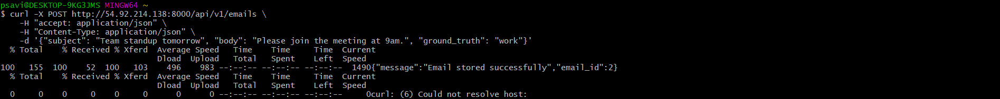
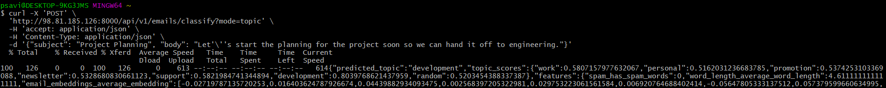

# SEIS-765 ML Ops: Homework 1

## Pam Savira

Repository: [https://github.com/psavira/lab2_factories](https://github.com/psavira/lab2_factories)

# New Endpoints

- `POST /topic`

This endpoint adds a new topic. It takes a `name`, `description` as a json body request and saves it to `topic_keywords.json` file. It then returns if the topic has been successfully added and current stored topics.

- `POST /emails`

This enpoint stores a new email in `data/emails.json`. The endpoint accepts `subject`, `body`, and a optional `topic`. It then returns a message and a generated email id.

`POST /emails`

`POST /emails` with ground_truth

# Modified Endpoints
- `POST /emails/classify`

This endpoint now allows user to select one of two available strategies to classify an email. The default strategy is `topic`, which compares the input email against stored topic descriptions. The other strategy is `nearest`, which finds the most similar labeled stored email and uses its topic.

`POST /emails/classify`

`POST /emails/classify` using `nearest_email` mode

`POST /emails/classify` on a new topic

