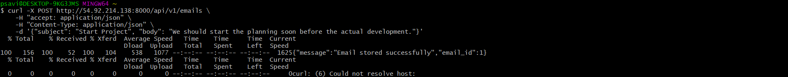

# SEIS-765 ML Ops: Homework 1

## Pam Savira

Repository: [https://github.com/psavira/lab2_factories](https://github.com/psavira/lab2_factories)

# New Endpoints

- `POST /topic`

This endpoint adds a new topic. It takes a `name`, `description` as a json body request and saves it to `topic_keywords.json` file. It then returns if the topic has been successfully added and current stored topics.

```bash
# Add a new topic
  curl -X POST http://54.92.214.138:8000/api/v1/topics \
    -H "accept: application/json" \
    -H "Content-Type: application/json" \
    -d '{"name": "winter", "description": "snow, cold, ice"}'
```


- `POST /emails`

This enpoint stores a new email in `data/emails.json`. The endpoint accepts `subject`, `body`, and a optional `topic`. It then returns a message and a generated email id.

`POST /emails`

```bash
# Store an email without a label
  curl -X POST http://54.92.214.138:8000/api/v1/emails \
    -H "accept: application/json" \
    -H "Content-Type: application/json" \
    -d '{"subject": "Team standup tomorrow", "body": "Please join the meeting at 9am."}'
```



`POST /emails` with ground_truth

```bash
# Store an email with a ground truth label
  curl -X POST http://54.92.214.138:8000/api/v1/emails \
    -H "accept: application/json" \
    -H "Content-Type: application/json" \
    -d '{"subject": "Team standup tomorrow", "body": "Please join the meeting at 9am.", "ground_truth": "work"}'
```


# Modified Endpoints
- `POST /emails/classify`

This endpoint now allows user to select one of two available strategies to classify an email. The default strategy is `topic`, which compares the input email against stored topic descriptions. The other strategy is `nearest`, which finds the most similar labeled stored email and uses its topic.

`NearestEmailClassifierModel` class classifies an email by comparing it to previously stored and labeled emails if the user selects `nearest` as its `mode` or strategy. The topic of the most similar labeled email will get selected as the prediction. 

`POST /emails/classify`

```bash
# Classify an email (default topic mode)                                                                                                                                          
  curl -X POST http://54.92.214.138:8000/api/v1/emails/classify \
    -H "accept: application/json" \
    -H "Content-Type: application/json" \
    -d '{"subject": "Team standup tomorrow", "body": "Please join the meeting at 9am."}'
```


`POST /emails/classify` using `nearest_email` mode

```bash                                                                                                                                                                                
# Classify using nearest stored labeled email                                                                                                                                     
  curl -X POST "http://54.92.214.138:8000/api/v1/emails/classify?mode=nearest_email" \
    -H "accept: application/json" \
    -H "Content-Type: application/json" \
    -d '{"subject": "Team standup tomorrow", "body": "Please join the meeting at 9am."}'
```


`POST /emails/classify` on a new topic

```bash
# Classify an email (on a new topic)                                                                                           
  curl -X POST http://98.81.185.126:8000/api/v1/emails/classify \
    -H "accept: application/json" \
    -H "Content-Type: application/json" \
    -d '{"subject": "Project Planning", "body": "Let's start the planning for the project soon so we can hand it off to engineering."}'
```

